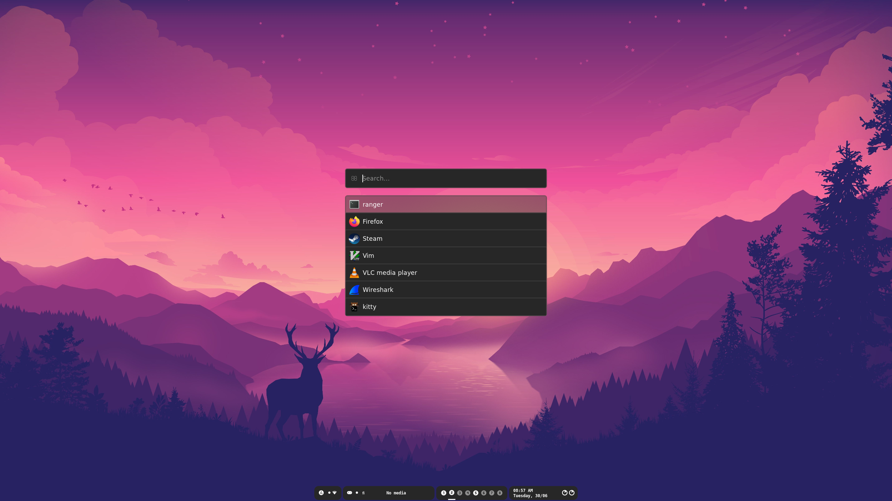
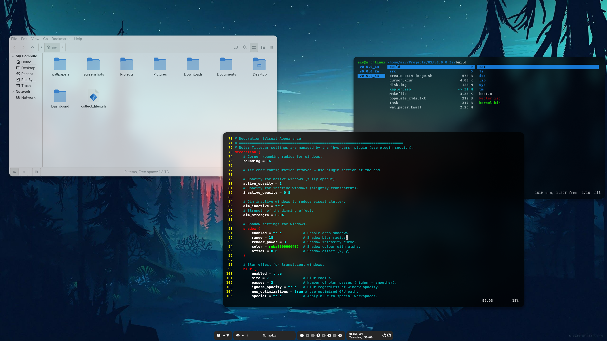

# Arch Linux Hyprland Setup

[](LICENSE)
[](https://archlinux.org/)
[](https://hyprland.org/)
[](https://www.zsh.org/)
[](https://sw.kovidgoyal.net/kitty/)
[](https://github.com/Alexays/Waybar)
[](https://github.com/davatorium/rofi)
[](https://firejail.wordpress.com/)
[](https://github.com/ValveSoftware/Proton)

## Overview

This repository delivers a **fully automated installer** for a modern Arch Linux desktop environment centered around **Hyprland** – a dynamic tiling Wayland compositor. The setup combines eye‑candy visuals, robust security, and a highly productive workflow. Everything is configured with a consistent dark/light theme and can be deployed with a single command.

The environment is built from carefully selected components:

- **Hyprland** – smooth animations, transparency, and Vim‑style window controls.
- **Kitty** – GPU‑accelerated terminal with ligatures and a custom theme.
- **Waybar** – highly customisable status bar (theme adapted from [minimal-waybar-themes](https://github.com/atif-1402/minimal-waybar-themes/)).
- **Rofi** – versatile launcher and window switcher (configuration based on [rofi-config](https://github.com/anhsirk0/rofi-config)).
- **Zsh** with **Zim** framework and **Powerlevel10k** prompt.
- **Firejail** – sandboxing for all applications.
- **Proton** – seamless Windows `.exe` execution via binfmt.
- **LightDM** – lightweight display manager with a custom greeter.

All configuration files are stored in this repository and deployed automatically, with backups of your existing settings.

---

## Features

| Component         | Description                                                                 |
|-------------------|-----------------------------------------------------------------------------|
| **Hyprland**      | Dynamic tiling with rounded corners, blur, and smooth animations.           |
| **Hyprpaper**     | Lightweight wallpaper daemon with dynamic reloading.                       |
| **Hyprlock**      | Simple and elegant lock screen.                                            |
| **Kitty**         | Terminal with GPU acceleration, ligatures, and a clean theme.              |
| **Waybar**        | Fully styled status bar with workspaces, volume, battery, and more.       |
| **Rofi**          | Application launcher, window switcher, and custom powermenu.               |
| **Nemo**          | Feature‑rich file manager with a modern look.                              |
| **Firejail**      | Global sandboxing via `firecfg` – all apps run with reduced privileges.   |
| **Proton binfmt** | Double‑click any `.exe` – automatically runs with Proton/Wine.            |
| **Zsh + Zim**     | Lightning‑fast Zsh with Powerlevel10k prompt, plugins, and completions.   |
| **LightDM**       | Customized login screen with a clean theme.                               |
| **Wallpaper Script** | Easy script to rotate or set wallpapers from the command line.          |
| **Security**      | Firejail, binfmt isolation, and minimal attack surface.                    |
| **Theme Switching** | Light/dark mode support via Rofi and GTK themes (automatically detected). |

---

## Screenshots & Gallery

> *Replace the placeholder image paths with your own screenshots. All images are stored in the `screenshots/` directory of this repository.*

<div align="center">
  
  <p><strong>Figure 1:</strong> Main desktop with Hyprland, Waybar, and Kitty</p>
</div>

<div align="center">
  
  <p><strong>Figure 2:</strong> Rofi application launcher in action</p>
</div>

<!--
<div align="center">
  
  <p><strong>Figure 7:</strong> Custom LightDM greeter with wallpaper background</p>
</div>
-->

<div align="center">
  
  <p><strong>Figure 3:</strong> Dynamic tiling and workspace overview</p>
</div>

---

## Video Demo

Watch a full walkthrough of the system in action, including Hyprland navigation, Rofi usage, and wallpaper switching.

<video width="800" controls>
  <source src="screenshots/demo.mp4" type="video/mp4">
  Your browser does not support the video tag.
</video>

<!-- You can also view the demo on [YouTube](https://youtu.be/video-link). -->

---

## Repository Structure

```
hyprland-setap/
├── cava
│   └── config
├── hypr
│   ├── hyprland.conf
│   ├── hyprlock.conf
│   └── hyprpaper.conf
├── kitty
│   └── kitty.conf
├── lightdm
│   └── lightdm.conf
├── rofi
│   ├── colors
│   │   └── nord.rasi
│   ├── launchers
│   │   ├── launcher.sh
│   │   ├── shared
│   │   │   ├── colors.rasi
│   │   │   └── fonts.rasi
│   │   └── style.rasi
│   └── powermenu
│       ├── powermenu.sh
│       ├── shared
│       │   ├── colors.rasi
│       │   └── fonts.rasi
│       ├── style.rasi
│       └── styles
│           ├── colors.rasi
│           └── nordic.rasi
├── screenshots
│   ├── 2026-06-30_08-53-42.png
│   └── 2026-06-30_08-57-37.png
├── wallpapers
│   └── wallpaper.jpg
├── wallpaper_setup.sh
├── waybar
│   ├── clock.sh
│   ├── config.jsonc
│   ├── style.css
│   └── window.sh
├── install.sh
├── LICENSE
└── README.md
```

All configuration files are designed to be modular – you can tweak any part to match your personal style.

---

## Installation

### Prerequisites

- A working **Arch Linux** system with a network connection.
- `sudo` privileges.
- Basic familiarity with the terminal.

### Steps

1. **Clone the repository**  
   ```bash
   git clone https://github.com/one-of-all/hyprland-setap.git;
   cd hyprland-setap
   ```

2. **Make the installer executable**  
   ```bash
   chmod +x install.sh
   ```

3. **Run the installer with sudo**  
   ```bash
   sudo ./install.sh
   ```

   The script will:
   - Ask for the wallpaper directory (default: `~/wallpapers/`).
   - Update your system.
   - Install all required packages (official + AUR).
   - Backup existing configs (`~/.config/hypr`, `kitty`, `waybar`, `rofi`) with a timestamp.
   - Deploy the new configuration files.
   - Set up Firejail, Proton binfmt, Zsh, and LightDM.
   - Enable the LightDM service.
   - Set the default wallpaper (`wallpaper.jpg`).

4. **Reboot** to start your new environment  
   ```bash
   reboot
   ```

   After restart, LightDM will greet you. Log in and enjoy your fresh Hyprland session.

---

## Post-Installation Customization

- **Wallpaper** – Run `wallpaper_rofi.sh` to select a new wallpaper from your directory. The script updates Hyprpaper and creates a blurred version for the lock screen.
- **Hyprland keybindings** – Modify `~/.config/hypr/hyprland.conf` to add or change shortcuts.
- **Waybar modules** – Edit `~/.config/waybar/config` to adjust the status bar layout. The theme is adapted from [minimal-waybar-themes](https://github.com/atif-1402/minimal-waybar-themes/).
- **Rofi themes** – Replace files in `~/.config/rofi/` with your own. The current setup is based on [anhsirk0/rofi-config](https://github.com/anhsirk0/rofi-config).
- **Zsh plugins** – Add more modules in `~/.zshrc` via Zim.
- **LightDM** – Adjust `/etc/lightdm/lightdm.conf` to change the greeter or autologin settings.
- **Theme switching** – The Rofi theme automatically adapts to your GTK theme (light/dark). You can force a theme using `change-theme.pl` or the `rofi-theme-selector.sh` script.

All deployed configs are fully commented – feel free to explore and tailor them to your workflow.

---

## Security Features

This setup emphasises security without sacrificing usability:

- **Firejail** – Every application is sandboxed by default (via `firecfg`). This restricts access to your system and personal files.
- **Proton binfmt** – Windows executables run inside a Proton sandbox, minimising exposure to malicious code.
- **Minimal attack surface** – The system runs only essential services. LightDM is lightweight and does not expose unnecessary network ports.
- **Zsh hardening** – The shell is configured with safe defaults and no insecure plugins.
- **User separation** – The installer runs as root but uses `sudo -u` for user‑specific tasks, avoiding privilege escalation issues.
